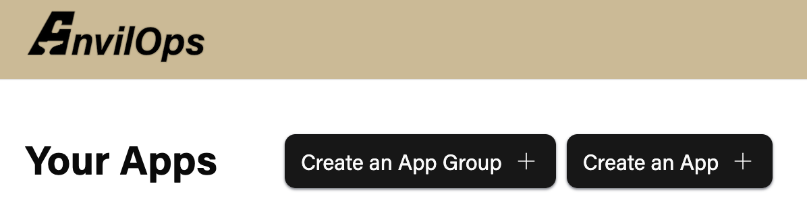
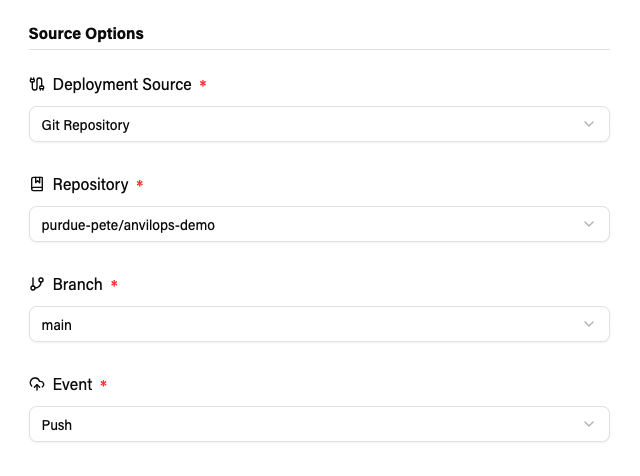
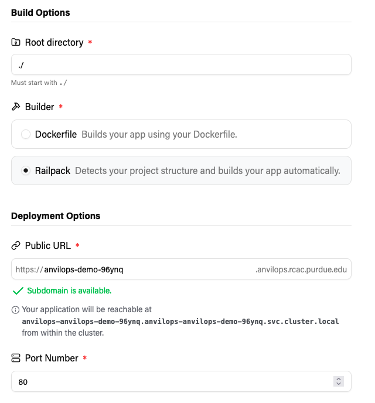
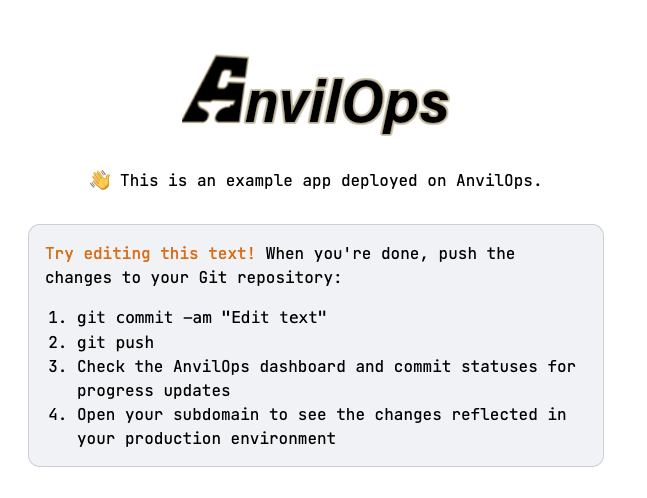
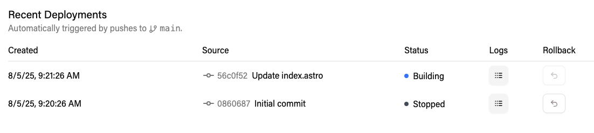

If you have already installed the AnvilOps GitHub App for your organization, you can deploy applications from GitHub repositories that you have given the GitHub App access to.

### Initial Configuration

1. Click the Create App button on the AnvilOps dashboard.
   

2. After selecting an Organization (and a Rancher project), select `Git Repository` as the Deployment Source.

3. Click the repository dropdown, and select `External Git Repository`.

4. Select the `AnvilOps Demo` template app. You will be prompted to import the `anvilops-demo` repository to your account.

   The default settings configure AnvilOps to automatically redeploy your application when a new commit is pushed to the `main` branch of your repository.

   

5. Look over the settings that have been autofilled.

   **Build**: AnvilOps will use Railpack to detect the framework your repository uses([Astro](https://astro.build/)) and build it without extra configuration.

   **Port**: The application will listen on port 80 for requests.

   If you would like, replace the randomly generated subdomain with something nice.

   

6. Click `Deploy`. In a few minutes, the application should be up and running at \
   `https://<subdomain>.anvilops.rcac.purdue.edu`.

   

### Continuous Deployment

Try pushing a commit to the repository to see how AnvilOps updates the deployment.

1. Open the file `/src/pages/index.astro` in your repository.

2. Find the section that says `Try editing this text!` and change it to say `Hello, World!` or another phrase of your choice. Then commit and push your changes to the repository.

3. Go back to the dashboard for your app in AnvilOps. Under `Recent Deployments`, you should see a new entry. If you click the `Logs` button for that deployment, you can watch the logs as AnvilOps rebuilds the application.
   

4. When the build completes, go back to `https://<subdomain>.anvilops.rcac.purdue.edu` and reload the page. It should have the updated text.
