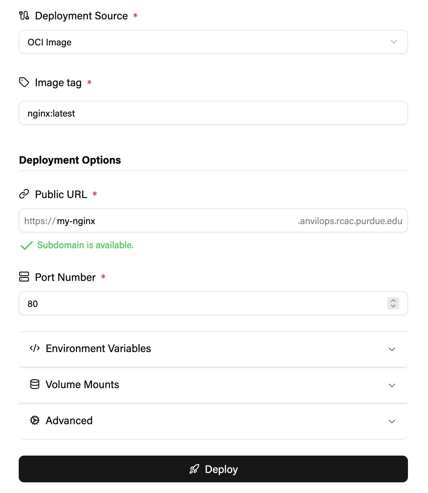

import { Steps } from "@astrojs/starlight/components";

If you would like to deploy an application on Anvil Composable, follow along at [`https://anvilops.rcac.purdue.edu`](https://anvilops.rcac.purdue.edu). If you would like to deploy on Geddes, follow these instructions on [`https://anvilops.geddes.rcac.purdue.edu`](https://anvilops.geddes.rcac.purdue.edu).

## Creating an App

### Prerequisites

- A **GitHub repository** or publicly available OCI-compliant **container image** (e.g. Docker image).
  - Singularity images are not currently supported.
- A **Rancher Project** to deploy your project inside.
  - Consult your administrator to gain access to one. A Rancher Project will serve as a workspace in which you can run applications.
  - A Project is a group of namespaces which can be configured with access controls and resource quotas.
  - If you do not have access to a Project at this time, you can deploy your application temporarily in the `anvilops_sandbox` Project.

### Deploying an App

Navigate to the Create App page in order to configure and launch your app. You will need to select your Project, the repository or image you would like to deploy, a subdomain, and the port number of the application.

If your app is a web application, you can make it publicly accessible at an available subdomain of your choice. Otherwise, uncheck the `Make my app public` box.

If you are deploying a Git repository, you will need to specify the build configuration.

If your repository already contains a Dockerfile, select the `Dockerfile` option and provide the path to the file. For instance, if the Dockerfile is in the root directory of your application, enter `Dockerfile`.

If your repository does not contain a Dockerfile, we encourage you to try the `Railpack` builder, which detects common application types in order to automatically build them.

For more information on available parameters, see the [configuration guide](/AnvilOps/reference/configuration).

When you click Deploy, AnvilOps will build and run your application on the cluster.
