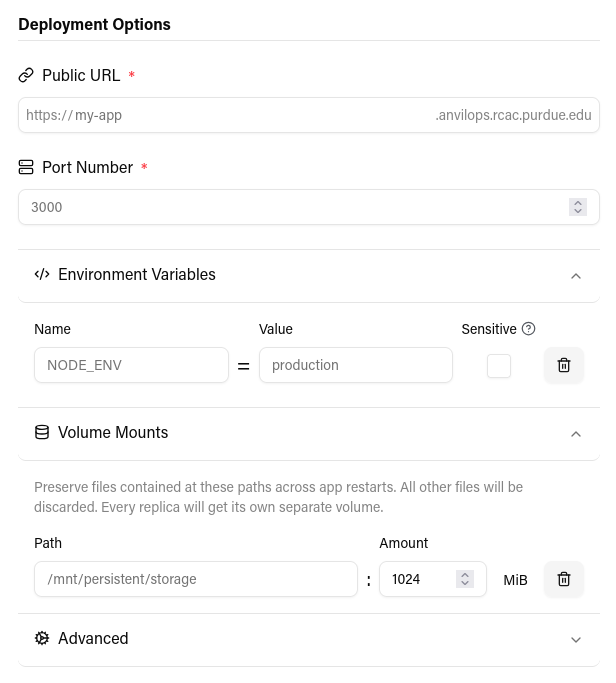
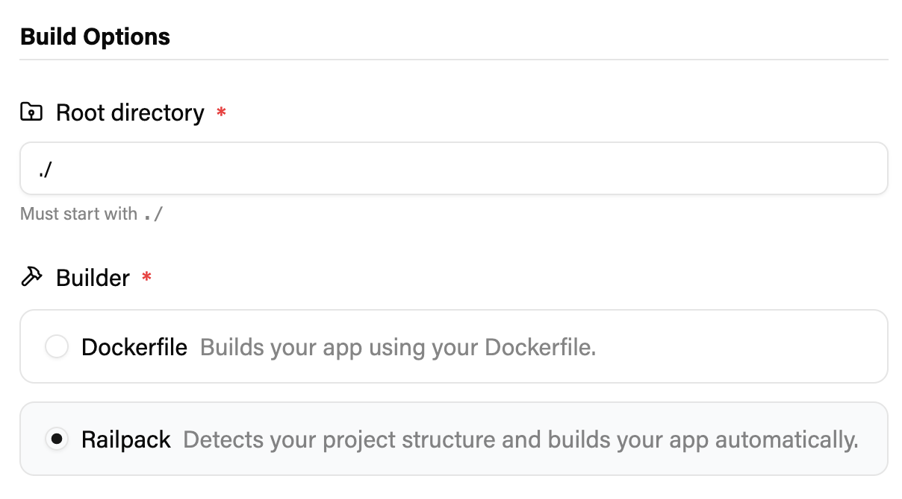
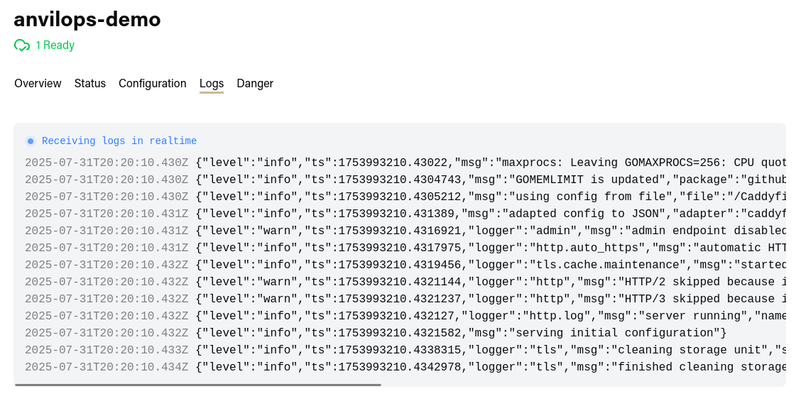
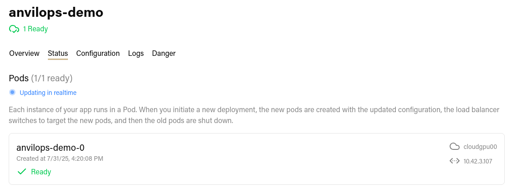

AnvilOps is a platform-as-a-service for Kubernetes.

- Platform-as-a-service: a system that allows users to deploy applications with no concern for the underlying infrastructure. A PaaS typically provides conveniences, like logging and monitoring, CI/CD, and horizontal scaling so that users do not have to manage them themselves.
- [Kubernetes](https://kubernetes.io/): a container orchestration system with a powerful set of features for deploying containerized applications, scaling them across servers, and ensuring they are available.
- Container: A lightweight unit of software containing all the code and dependencies an application needs to run. Containers are useful for running applications in different environments or at scale.

AnvilOps can deploy applications on Geddes from `https://anvilops.geddes.rcac.purdue.edu`, or on Anvil Composable from `https://anvilops.rcac.purdue.edu`.

## Key Features

### Easy Configuration

Kubernetes is extremely powerful, but its large feature set makes it quite complex to configure. AnvilOps automates the process of writing Kubernetes manifests and provides a simple user interface that's accessible to beginners.

### CI/CD

CI/CD stands for Continuous Integration and Continuous Delivery/Deployment. It's the name for a set of systems that enable software developers to release updates quickly by automating the build, testing, and deployment processes.

AnvilOps can automatically builds your application for you. Just select one of the builders: the Dockerfile builder, for customized builds, or [Railpack](${import.meta.env.BASE_URL}/reference/railpack), which detects the application type and automatically builds it.

AnvilOps can automatically build and deploy your app in response to certain events. For instance, when you push a commit to your GitHub repository, AnvilOps will rebuild your application and immediately deploy the change, allowing you to iterate quickly without setting up a custom CI/CD pipeline.

### Logging and Monitoring

The AnvilOps web dashboard provides tools to view your application's logs in real time.

You can also see the current status of all your application's pods in realtime along with any events or conditions that could be preventing them from running.

### Automatic Subdomain and TLS Certificate

Every app deployed on AnvilOps can have its own subdomain, and TLS encryption is handled for you. On Anvil, you may select a subdomain of `anvilcloud.rcac.purdue.edu`. On Geddes, you may select a subdomain of `geddes.rcac.purdue.edu`.
