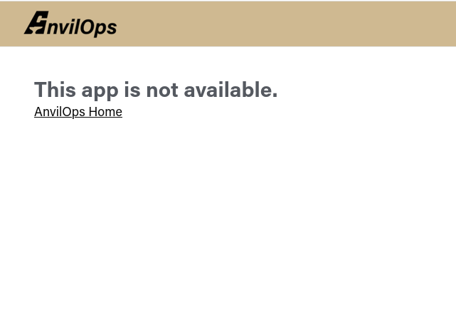

## Public Subdomain

When you create an app, you must select a unique public subdomain. This cannot be changed after the app is created. This allows AnvilOps to make your app accessible at `<your subdomain>.anvilops.rcac.purdue.edu`.

Your public subdomain only supports HTTP. Services like databases which rely on other protocols won't be accessible.

When a user visits `https://<your subdomain>.anvilops.rcac.purdue.edu`, AnvilOps routes the traffic to the corresponding app over the port number specified in the app's configuration.

If your port number is not set properly, you may see a message like this when you visit your public subdomain:



## Accessing From Other AnvilOps Apps

Your AnvilOps app is accessible to other apps inside the Kubernetes cluster at the following address, on port 80:

```
anvilops-<subdomain>.anvilops-<subdomain>
```

**Your service is always exposed at this address on port 80, even if you specified a different port in your configuration.**
