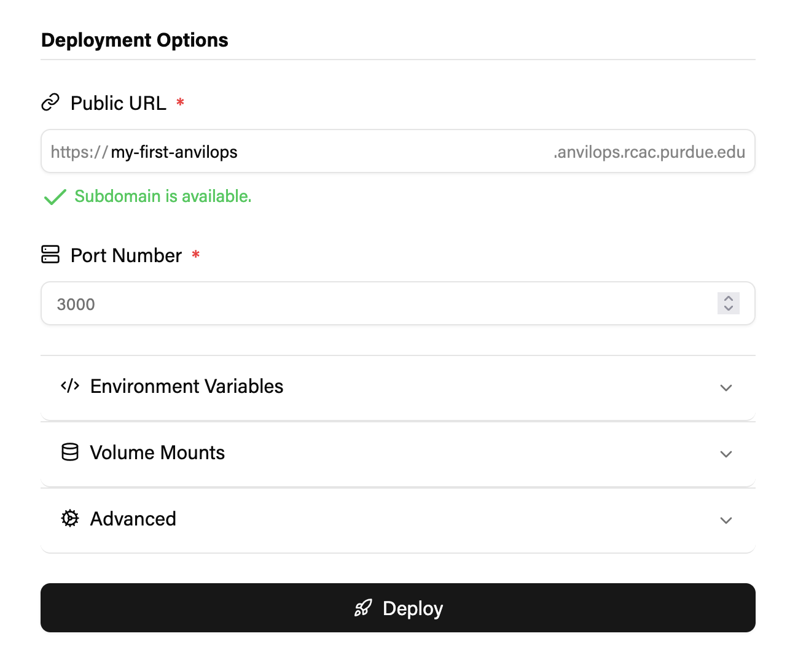

If you have already installed the AnvilOps GitHub App for your organization, you can deploy applications from GitHub repositories that you have given the GitHub App access to.

### Getting started

1. Click the Create App button on the AnvilOps dashboard.
   

2. After selecting an Organization, select `Git Repository` as the Deployment Source. Then select a repository to deploy, along with a branch of the repository to use.

> **ⓘ Not sure what to deploy?** \
> Click the repository dropdown, then select `External Git Repository`. Then, you can import one of the AnvilOps template apps. The repository will be cloned to your account, and required configuration parameters in the form will be autofilled. Alternatively, you can clone any public repository to your account.

3. Select an [event](/reference/git-integration/#events-that-trigger-deployments) to trigger redeployment. AnvilOps currently supports redeployment on push, or on successful workflow run.

### Build configuration

4. Enter the root directory of your project, or the path of the directory that the code you are deploying is organized under.

5. Select a builder.\
   **Dockerfile**: If your project contains a Dockerfile, you can select the Dockerfile builder. You will need to provide the path to the Dockerfile, relative to the root directory. For instance, if the root directory of the project you want to deploy is `./api` and the desired Dockerfile is located at `./api/Dockerfile`, then the path to the dockerfile should be `Dockerfile`.
   **Railpack**: Projects using supported languages or frameworks can be built using the Railpack builder without providing build configuration via Dockerfile. Check [here](/reference/railpack) for the list of supported application types.

### Deployment options

 6. Select a unique subdomain for your app. Your app will be made publicly accessible at `https://<subdomain>.anvilops.rcac.purdue.edu`.

7. Enter the port number your application listens on. Kubernetes will route requests to `https://<subdomain>.anvilops.rcac.purdue.edu` to this port for your applications to process.

8. Add any environment variables your app requires. Environment variables can be marked as sensitive. Sensitive environment variables cannot be viewed after they are set, although they can be updated.

9. If your app requires storage that persists across restarts, configure volume mounts. Make sure to select an appropriate path and storage limit— these values cannot be changed later.

10. Click `Deploy`.
